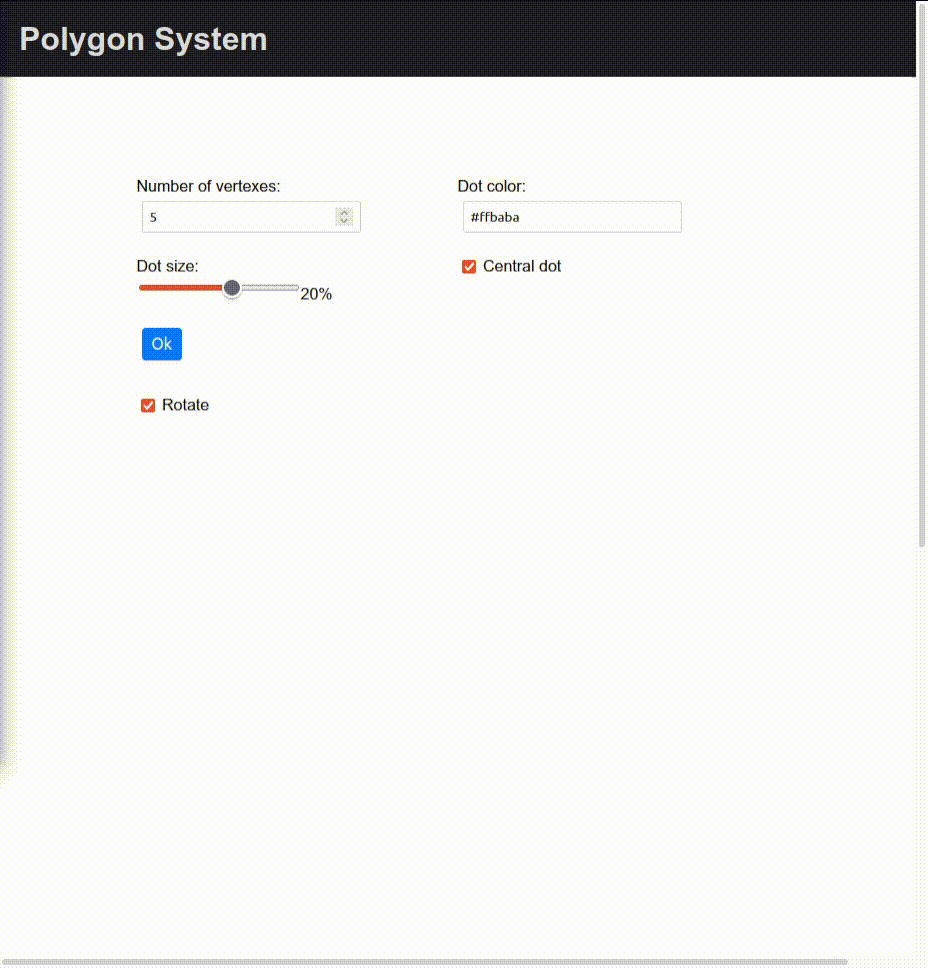

# Polygon System

    

A very simple web app to draw the vertices of a given regular polygon with HTML and CSS. The sizing and coloring of the drawing are customizable.

This system I made was used to help me with something to a front-end thing I did, then I improved it for GitHub because why not?

## Special Thanks

To my brother that helped me at developing the main algorithm.